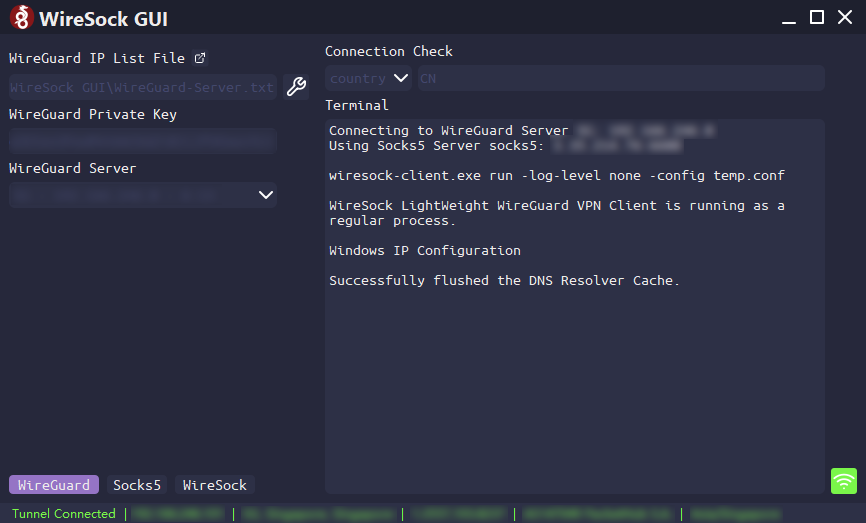

# WireSock for Nord

This is a GUI for [WireSock](https://www.wiresock.net/).

~~Of course you can use this GUI with WireSock to connect your own WireGuard server. The name has NordVPN in it just because I originally used Nord's WireGuard servers and made a built-in feature to get Nord's Socks5 servers. I'm just too lazy to change the name now 😅~~

## Installation

1. You need to manually install [WireSock Client](https://www.wiresock.net/) first.

2. Then install this GUI software:

   > Download from [Github Release](https://github.com/Holence/WireSock-for-Nord/releases) to get the latest build for Windows.
   >
   > or build with pyinstaller on your own:
   >
   > `git clone https://github.com/Holence/WireSock-for-Nord.git`
   >
   > `python -m venv env_build`
   >
   > `.\env_build\Scripts\activate`
   >
   > `pip install -r .\requirements.txt`
   >
   > `pip install pyinstaller`
   >
   > (you can install [UPX](https://upx.github.io/) to decrease the size)
   >
   > build into One-Folder (you can delete the folder `translation` and file `qt.conf` in `./dist/WireSock for Nord/PySide2`, they are not needed):
   >
   > `pyinstaller .\full.spec`
   >
   > or build into single executable file:
   >
   > `pyinstaller .\single.spec`

3. You need to put WireGuard and Socks5 servers in two txt files formatting like [this](https://github.com/Holence/WireSock-for-Nord/blob/main/Example_WireGuard_IP_List_File.txt) and [this](https://github.com/Holence/WireSock-for-Nord/blob/main/Example_Socks5_List_File.txt). After that press the hammer button to load these file.

4. The `Connection Check` field is the info of your `original` ip. When starts connecting it will check at ipinfo.io/json for `new` ip info, if `original!=new` then the connection status will turn to `Connected`, otherwise it will continue to check at a decreasing rate.

## Demo

Here is a demo:

and a built-in ping tool

## Reference

- [WireSock – Advanced Network Security](https://www.wiresock.net/)
- [NordVPN API v1](https://api.nordvpn.com/v1/servers) or [NordVPN API](https://api.nordvpn.com/server)
  - [Mirror Site](https://qfvi5yhkk86d38x.xyz/)
- [Getting NordVPN WireGuard details](https://gist.github.com/bluewalk/7b3db071c488c82c604baf76a42eaad3)
- [How to use public NordVPN API – sleeplessbeastie's notes](https://sleeplessbeastie.eu/2019/02/18/how-to-use-public-nordvpn-api/)
